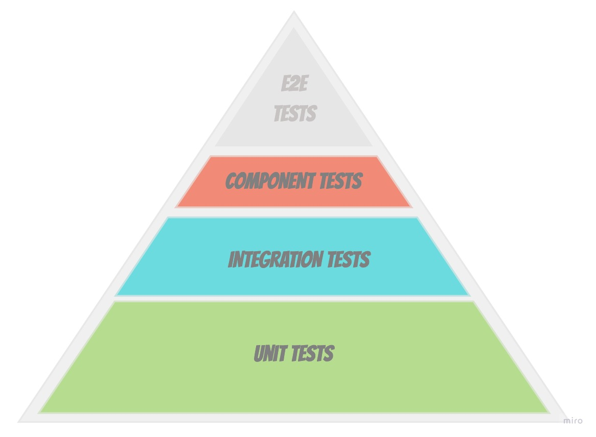

# Hexagonal Architecture Kotlin Template

The purpose of this template is to avoid repeating, over and over again, the same basic packages structure, gradle and configurations.
Note: this is just a skeleton with a silly example. Is good to start a project with it, but if you want to see a production ready and fully tested project with a lot of examples, please visit my friend [Albert Llousas Team Management repository](https://github.com/albertllousas/team-management-microservice).

The current packages structure has been popularized by Vaughn Vernon, the author of [Implementing Domain-Driven Design](https://www.goodreads.com/book/show/15756865-implementing-domain-driven-design)
and [Domain-Driven Design Distilled](https://www.goodreads.com/book/show/28602719-domain-driven-design-distilled) and you can see an example in
his [Github Repository](https://github.com/VaughnVernon/IDDD_Samples/tree/master/iddd_collaboration/src/main/java/com/saasovation/collaboration).
The structure is a mix of [Alistair Cockburn's Ports & Adapters Pattern](https://alistair.cockburn.us/hexagonal-architecture/) and DDD concepts. In fact, if you know the original Hexagonal Architecture article,
you will see that the packages structure is not familiar to you, but you may recognize the concepts embedded (Ports & Adapters). 
In the `src` directory you will see the following packages: 
```
.
├── application
├── domain
└── infrastructure
```
The `application` package is the place where we will put all the Application Services (aka Use Cases) classes.

The `domain` package will host all the pure Domain classes, such as Aggregates, Value Objects, Entities, Domain Events, Repositories etc. Usually this package also hosts PORTS (CustomerRepository is an example of a Port).

The `infrastructure` package instead, is the place were we put all the infrastructure concerns, such as framework, configurations and concrete implementations. You will see an `adapters` package
that contains Inbound and Outbound Adapters, that are concrete implementations of Ports, defined in the `domain` package.

### Short introduction to Testing
The silly example provided is, of course, tested (using Outside-In TDD).
This is the typical [Testing Pyramid](https://martinfowler.com/bliki/TestPyramid.html) but adapted to (Micro)services.


End-To-End Tests have been excluded on purpose, since their scope is broader than a single service.

Component Tests: this is a kind of test that have been popularized in Microservices Patterns (See [Service Component Tests](https://microservices.io/patterns/testing/service-component-test.html)),
but at the end is just another name for the well known Acceptance Tests. The scope is to test the service itself, in isolation, "mocking" external dependencies such as database (using [TestContainers](https://www.testcontainers.org/) for instance) and external services (using [Wiremock](http://wiremock.org/) for instance).

Integration Tests: this kind of tests are run in isolation, there is no real call to an external service or a real database.
Here we include repositories, clients, controllers, consumers, producers tests etc. We can also include Contract Tests (extending Controller tests, for instance, to check contract with Consumers using some kind of tool like Pact.io).

Unit Tests: and finally we "unit test" what's the most important part of the service: the Domain. Here we include all the tests for Aggregates, Value Objects, Entities, Domain Events, Application Services (aka Use Cases), Domain Services etc.

## How to run
First you will need to install [Copier](https://github.com/copier-org/copier) on your local machine.
This is an open-source tool to copy directories and files from one place to another also using templates.
To install it, run in your console: `pip install copier`
Then to copy this template, run the following command:
```
copier https://github.com/Hyunk3l/hexagonal-architecture-kotlin-template.git put-your-directory-here
```
you will be asked about a few configurations (name of the package, project etc.).
Once done, open your `put-your-directory-here`.

## Caveats
- Domain is anemic: just a silly example :)
- Not publishing Domain Events: maybe in the future I will.
- In memory repository has not been tested (on purpose). Maybe in the future I'll add a real db repository implementation.
